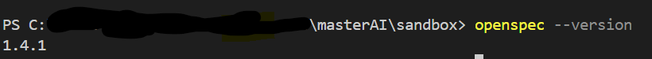
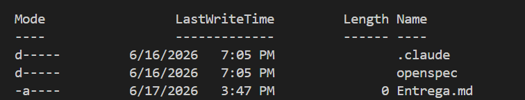

# Parte A

*Micro-tarea:* Detectar el tono de mensajes cortos y clasificarlo como amable, neutral o agresivo.

*Pilar 1 — Herramienta:* ¿Cuál eliges?
Claude

 ¿Por qué esta y no otra?
Suele ir muy bien en tareas de análisis de texto y redacción. Además, es útil ya que quiero una clasificación de tono más “delicada” y matizada.

*Pilar 2 — Contexto:* ¿Qué información estás aportando?
- Idioma: español
- Tarea: clasificar tono en mensajes cortos
- Clases posibles: amable, neutral, agresivo
- Restricción: el mensaje puede ser ambiguo, así que quiero una salida consistente
- Ejemplos de referencia: mensajes con “por favor”, “gracias”, “hazlo ya”, “ok.”
 
 ¿Hay algo del contexto que has decidido omitir conscientemente?
Sí: no incluyo contexto conversacional largo ni información personal, porque quiero que el modelo trabaje solo con el mensaje breve. También omito una taxonomía más fina de tonos para mantener la tarea simple.

*Pilar 3 — Prompt:* ¿Cómo lo estructuras?

Lo estructuro con:
- rol claro
- objetivo explícito
- etiquetas de salida cerradas
- criterio de decisión
- ejemplos cortos
- formato de respuesta fijo
 
 Actúa como un clasificador de tono en español para mensajes cortos.  
Tu tarea es analizar un mensaje y devolver una sola etiqueta entre estas tres: **amable**, **neutral** o **agresivo**.

Reglas:

- **amable**: el mensaje muestra cortesía, respeto, colaboración o gratitud.
- **neutral**: el mensaje es informativo, directo o sin carga emocional clara.
- **agresivo**: el mensaje suena brusco, hostil, impaciente o despectivo.

Considera señales como emojis, signos de exclamación, mayúsculas y palabras de cortesía.  
Si el tono es ambiguo, elige la etiqueta más probable según el texto literal.

Devuelve solo esta estructura:

- **Etiqueta:** [amable / neutral / agresivo]
- **Breve justificación:** una frase corta
- 
*Resultado:* ¿Funcionó a la primera o tuviste que iterar?
 Si, funcionó a la primera

 # Parte B

 ## Comandos funcionando 

# Observaciones

1. Es impresionante como en algunos segundos se instalan varios skills, que permiten a la herramienta ser realmente poderosa, tengo bastantes expectativas de como seria extender los skills y que mas skill se podrian crear
2. Me pregunto si la carpeta de changes tendra una jerarquia de carpetas, de iteraciones, estado de las tareas, o alguna buena practica en especifico
3. El config.yaml se puede cambiar a otro tipo de archivo? Se puede dividir en varios archivos o solo es un archivo de configuración? Que buenas practicas existen para usar openSpec para optimizar los costos y resultados.
